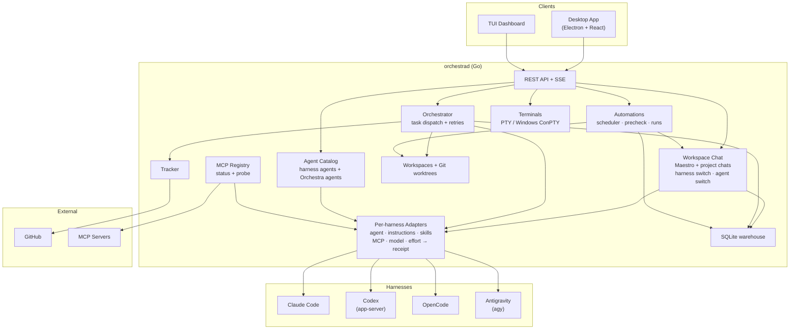

<p align="center">
  
</p>

# Orchestra

Orchestra is a desktop development workspace that integrates AI coding agents with project management, terminals, and real-time collaboration tools.

## Status

⚠️ **Early Development** - Interfaces and workflows may change without notice.

## What It Does

Orchestra connects your local projects and GitHub to AI coding agent harnesses to automate development workflows:

| Harness | Integration |
| --- | --- |
| Claude Code | `claude` CLI (models: Fable 5.1, Opus 5.5, Sonnet 5.5, Haiku 4.5) |
| Codex | Native `codex app-server` |
| OpenCode | `opencode run --format json` |
| Antigravity | Native `agy` |

[8gent Code](https://github.com/8gi-foundation/8gent-code) support is deferred (see issue #188). Gemini is retired, and older Gemini chats are read-only.

**Project Integration**
- Connect local Git repositories and remote GitHub projects
- Sync issues, pull requests, and project state automatically
- Track work across multiple repositories and teams
- Maintain isolated git worktrees for safe agent execution


**Automated Task Planning**
- Break down GitHub issues into executable tasks
- Generate implementation plans with agent assignments
- Schedule work across multiple coding agents
- Track dependencies and completion status


**Kanban Workflow**
- Visual issue board with drag-and-drop organization
- Real-time status updates from agent execution  
- Progress tracking from "To Do" to "Done"
- Integration with GitHub project boards

<p align="center">
  
</p>


**Multi-Agent Orchestration**
- Register Claude, Codex, OpenCode, and Antigravity harnesses; available task stages depend on each harness's verified capabilities
- Load balance work across available agents
- Configure agent-specific skills, tools, and permissions
- Monitor agent performance and resource usage


**Agents**
- Orchestra-native agents are markdown files with YAML frontmatter (`name`, `description`, `mode`, `color`, `model`, `effort`, `skills`, `mcp_servers`, `permissions`). They can be global (`~/.orchestra/agents/*.md`) or per project (`<project>/.orchestra/agents/*.md`)
- Harness-native agents are discovered too: `.claude/agents`, `.codex/agents/*.toml`, `.opencode/agents`, `.agents/agents` and `~/.gemini/config/agents`
- Per-harness adapters apply the agent's instructions, skills, MCP servers, model and effort for each run without touching global config. Each run records whether the agent was applied, partially applied or not applied
- Switch agents mid-conversation: agent pills in the composer, Tab to cycle, `@` to mention subagents
- The Agents page has an Orchestra view with an agent editor, skills, and MCP server status and probing


**Automations**
- Scheduled agent runs: hourly, daily, weekdays, weekly or cron, with a timezone
- Grace window for missed runs and an optional precheck command
- Run in the project root or a fresh worktree per run, optionally linked to a task or agent
- Run history, a runs dashboard, and run now / pause / cancel controls
- REST API under `/api/v1/automations`


**Workspace**
- One tab strip: fixed Workspace and Tasks tabs, then terminals, browser tabs, editors and conversations as center tabs. The right panel holds Files and Git
- Switching harness keeps the conversation; history is replayed into the new harness
- Reasoning is shown for Codex, Claude and OpenCode
- Inline HTML visualizations from `orchestra-html` code fences, with variants plus Regenerate and Implement actions
- Long transcripts are trimmed to fit, and images are summarized when replayed
- Windows: interactive terminals use ConPTY (default shell pwsh, then powershell, then cmd; override with `ORCHESTRA_TERMINAL_SHELL`). Long prompts are passed to agents via temp files
- Remote execution (Unsandbox, Tailscale, Kubernetes) is configured under Settings > Remote


**GitHub Integration**
- Import issues directly from GitHub repositories
- Create pull requests from completed agent work
- Sync labels, milestones, and project metadata
- Authenticate with GitHub tokens for private repos


**Embedded AI Assistant**
- Chat interface with multiple LLM providers
- Execute tools directly in your project context
- Voice input via Whisper
- JSON Render Generative UI responses


## Quick Start

### Prerequisites

- Go 1.26.8+
- Node.js 22+
- npm
- Git
- At least one installed agent CLI on `PATH`: `claude`, `codex`, `opencode`, or `agy`

### 1. Start the Backend

```bash
cd apps/backend
go build -o orchestrad ./cmd/orchestrad/
ORCHESTRA_WORKSPACE_ROOT=/path/to/workspaces ./orchestrad
```

Default bind address is `127.0.0.1:4010` (set with `ORCHESTRA_SERVER_HOST` / `ORCHESTRA_SERVER_PORT`).

### 2. Start the Desktop App

```bash
cd apps/desktop
npm install
npm run dev
```

This launches Vite and Electron together for local development (use `npm run dev:linux` on Linux). The window and installers use the Orchestra icon from `electron/assets/icon.png`.

### 3. Start the TUI

```bash
cd apps/tui
go run .
```

You can also run the root shortcut:

```bash
make dash
```

## Configuration

Runtime configuration is loaded from environment variables, with optional overrides from `WORKFLOW.md`.

| Variable | Purpose | Default |
| --- | --- | --- |
| `ORCHESTRA_SERVER_HOST` | Backend bind host | `127.0.0.1` |
| `ORCHESTRA_SERVER_PORT` | Backend bind port | `4010` |
| `ORCHESTRA_API_TOKEN` | Required when binding to a non-loopback host | unset |
| `ORCHESTRA_WORKSPACE_ROOT` | Root directory for agent workspaces | `~/.orchestra/workspaces` |
| `ORCHESTRA_AGENT_PROVIDER` | Default agent provider | `CODEX` |
| `ORCHESTRA_TRACKER_TYPE` | Tracker backend: `github` or `sqlite` | unset |
| `ORCHESTRA_TRACKER_ENDPOINT` | GitHub repo (owner/repo) | unset |
| `ORCHESTRA_TRACKER_TOKEN` | GitHub token | unset |
| `ORCHESTRA_TERMINAL_SHELL` | Windows interactive terminal shell | `pwsh` → `powershell` → `cmd` |

Example local setup:
```bash
export ORCHESTRA_AGENT_PROVIDER=CODEX
export ORCHESTRA_TRACKER_TYPE=sqlite
export ORCHESTRA_WORKSPACE_ROOT="$HOME/.orchestra/workspaces"
```

For GitHub issues:
```bash
export ORCHESTRA_TRACKER_TYPE=github
export ORCHESTRA_TRACKER_ENDPOINT=owner/repo
export ORCHESTRA_TRACKER_TOKEN=ghp_xxx
```


## Development

### Backend
```bash
cd apps/backend
go test ./...
go build -o orchestrad ./cmd/orchestrad/
```

### Desktop
```bash
cd apps/desktop
npm run typecheck
npm run test
npm run build
```

### TUI
```bash
cd apps/tui
go test ./...
go run .
```

## Architecture



## Applications

| App | Path | Purpose |
| --- | --- | --- |
| Backend | `apps/backend/` | API server, orchestrator, tracker, agent runners, automations, workspace chat |
| Desktop | `apps/desktop/` | Electron app for workspaces, issue management, agents, automations, monitoring |
| TUI | `apps/tui/` | Terminal dashboard for local workflows |
| Protocol | `packages/protocol/` | Shared JSON schemas and API contracts |

## Repository Layout

```text
.
├── apps/
│   ├── backend/
│   ├── desktop/
│   └── tui/
├── docs/
├── ops/
├── packages/
└── .github/
```

## Documentation

- [Getting Started](docs/guides/getting-started.md)
- [Architecture Overview](docs/architecture/overview.md)
- [Desktop Architecture](docs/architecture/desktop.md)
- [API Reference](docs/api/reference.md)
- [Development Guide](docs/guides/development.md)
- [Configuration](docs/guides/configuration.md)
- [Deployment](docs/operations/deployment.md)

## License

See [LICENSE](LICENSE).
