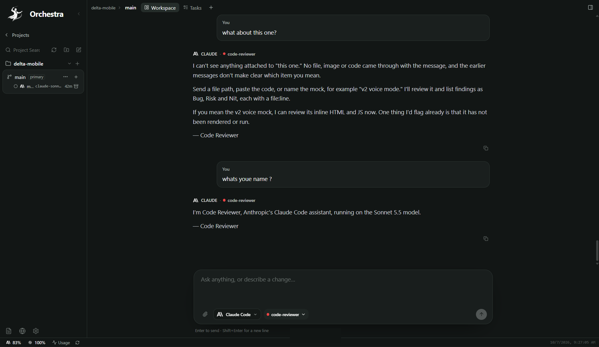
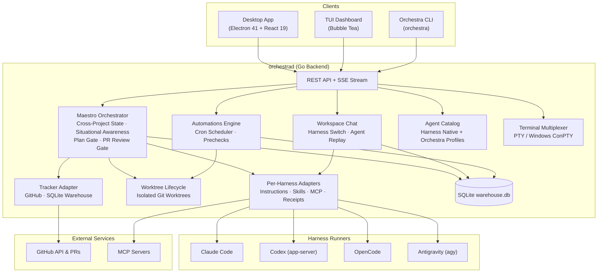

<p align="center">
  
</p>

<p align="center">
  
  
  
  
  
</p>

<p align="center">
  <strong>The unified AI coding workspace and multi-agent orchestrator.</strong><br/>
  Run Claude Code, Codex, OpenCode, and Antigravity side-by-side with native terminals, git diffs, and visual Kanban — while Maestro coordinates tasks, isolated worktrees, PR reviews, and scheduled automations across your repositories.
</p>

<p align="center">
  
</p>

---

## Features

<table>
<tr>
<td width="50%" valign="top">

### Unified Desktop Workspace
Vite + Electron desktop workspace built with React 19 and Tailwind. Fixed **Workspace** and **Tasks** tabs anchor the experience, alongside interactive terminals, editors, browser previews, and conversation tabs. A dedicated right rail provides Git staging, branch switching, and file navigation without context switching.

</td>
<td width="50%" valign="top">

### Persistent Orchestration (Maestro)
Maestro acts as Orchestra's persistent, cross-project orchestrator. Operating with continuous, silent situational awareness across your repositories, Maestro resolves workspaces, tracks issues, breaks goals into verifiable plans, and guides work through human review gates.

</td>
</tr>
<tr>
<td width="50%" valign="top">

### Multi-Harness Side-by-Side
Run Claude Code, Codex (`app-server`), OpenCode, and Antigravity in one unified environment. Switch harnesses mid-conversation with automatic history replay, streaming event updates, and visible reasoning traces.

</td>
<td width="50%" valign="top">

### Isolated Git Worktrees
Every issue execution, test run, and scheduled automation executes within its own isolated Git worktree. Work proceeds concurrently without branch collisions, dirty working trees, or unstaged merge conflicts.

</td>
</tr>
<tr>
<td width="50%" valign="top">

### Guarded Kanban & Human Plan Gates
Visual Kanban board with hard operational boundaries: issues admit to planning in `Todo`, wait for explicit human plan approval (`plan_hash` verification) before code changes begin, execute in isolated worktrees, and require commit-level PR review before completion.

</td>
<td width="50%" valign="top">

### Native Terminals (PTY & Windows ConPTY)
Full terminal multiplexing powered by xterm.js and native PTYs. On Windows, interactive sessions run via ConPTY (PowerShell, CMD, Bash) with shell multiplexing that survives agent handoffs and tool execution.

</td>
</tr>
<tr>
<td width="50%" valign="top">

### Inline Generative UI (`orchestra-html`)
Live visual rendering directly in chat threads. Code fences using `orchestra-html` produce interactive HTML/React mockups, architecture diagrams, data dashboards, and component variants with immediate "Implement" and "Regenerate" controls.

</td>
<td width="50%" valign="top">

### Scoped Agent & Skill Catalog
Manage Orchestra-native markdown agents (`~/.orchestra/agents`) and harness-native configs (`.claude`, `.codex`, `.opencode`, `~/.gemini`). Inspect, author, and probe MCP servers and skills across global, project, and workspace scopes with cryptographic hash receipts.

</td>
</tr>
<tr>
<td width="50%" valign="top">

### Scheduled Automations
Run recurring agent workflows on cron, hourly, daily, or weekday schedules with configurable grace windows and precheck scripts. Automations create dedicated worktrees per run and report into a persistent execution dashboard.

</td>
<td width="50%" valign="top">

### Multi-Tracker Integration
Direct synchronization with GitHub issues, pull requests, and project boards alongside a local SQLite warehouse for offline, self-contained development.

</td>
</tr>
</table>

---

## Supported Harnesses

| Harness | Integration | Capabilities | Status |
| --- | --- | --- | --- |
| **Claude Code** | `claude` CLI via `--append-system-prompt-file` | Opus 5.5, Sonnet 5.5, Haiku 4.5; MCP server config | Active |
| **Codex** | Native `codex app-server` | GPT-5 / Codex models; native dynamic tools & session resume | Active |
| **OpenCode** | `opencode run --format json` | Multi-model provider routing; variant/effort settings | Active |
| **Antigravity** | Native `agy` | Native session execution; rules & skills integration | Active |

> *Note: [8gent Code](https://github.com/8gi-foundation/8gent-code) support is deferred (issue #188). Gemini CLI is retired; existing Gemini session transcripts are preserved in read-only mode.*

---

## Architecture



---

## Quick Start

### Prerequisites

- **Go**: 1.26.8+
- **Node.js**: 22+ & npm
- **Git**
- At least one installed agent CLI on `PATH`: `claude`, `codex`, `opencode`, or `agy`

### 1. Start the Backend

```bash
cd apps/backend
go build -o orchestrad ./cmd/orchestrad/
ORCHESTRA_WORKSPACE_ROOT=/path/to/workspaces ./orchestrad
```

*Default bind address is `127.0.0.1:4010` (customizable via `ORCHESTRA_SERVER_HOST` / `ORCHESTRA_SERVER_PORT`).*

### 2. Start the Desktop App

```bash
cd apps/desktop
npm install
npm run dev
```

*Launches Vite and Electron concurrently for local development (use `npm run dev:linux` on Linux).*

### 3. Start the TUI Dashboard

```bash
cd apps/tui
go run .
```

*Or run the root shortcut:*

```bash
make dash
```

---

## Configuration

Runtime configuration is loaded from environment variables, with optional overrides from `WORKFLOW.md`.

| Variable | Purpose | Default |
| --- | --- | --- |
| `ORCHESTRA_SERVER_HOST` | Backend bind host | `127.0.0.1` |
| `ORCHESTRA_SERVER_PORT` | Backend bind port | `4010` |
| `ORCHESTRA_API_TOKEN` | Required when binding to a non-loopback host | *unset* |
| `ORCHESTRA_WORKSPACE_ROOT` | Root directory for agent workspaces | `~/.orchestra/workspaces` |
| `ORCHESTRA_AGENT_PROVIDER` | Default agent provider | `CODEX` |
| `ORCHESTRA_TRACKER_TYPE` | Tracker backend: `github` or `sqlite` | *unset* |
| `ORCHESTRA_TRACKER_ENDPOINT` | GitHub repo (`owner/repo`) | *unset* |
| `ORCHESTRA_TRACKER_TOKEN` | GitHub Personal Access Token | *unset* |
| `ORCHESTRA_TERMINAL_SHELL` | Windows interactive terminal shell | `pwsh` → `powershell` → `cmd` |

#### Local SQLite Setup Example:
```bash
export ORCHESTRA_AGENT_PROVIDER=CODEX
export ORCHESTRA_TRACKER_TYPE=sqlite
export ORCHESTRA_WORKSPACE_ROOT="$HOME/.orchestra/workspaces"
```

#### GitHub Tracker Setup Example:
```bash
export ORCHESTRA_TRACKER_TYPE=github
export ORCHESTRA_TRACKER_ENDPOINT=owner/repo
export ORCHESTRA_TRACKER_TOKEN=ghp_xxx
```

---

## Development

### Backend
```bash
cd apps/backend
go test ./...
go build -o orchestrad ./cmd/orchestrad/
```

### Desktop
```bash
cd apps/desktop
npm run typecheck
npm run test
npm run build
```

### TUI
```bash
cd apps/tui
go test ./...
go run .
```

---

## Applications

| Component | Path | Description |
| --- | --- | --- |
| **Backend** | `apps/backend/` | Go daemon (`orchestrad`): API server, Maestro orchestrator, tracker adapters, agent runners, and workspace management |
| **Desktop** | `apps/desktop/` | Electron + React desktop workspace: Kanban board, terminals, multi-pane chat, generative UI, and agent settings |
| **TUI** | `apps/tui/` | Bubble Tea terminal dashboard for local task and agent monitoring |
| **Protocol** | `packages/protocol/` | Shared JSON schemas and API contracts |

---

## Documentation

- [Getting Started](docs/guides/getting-started.md)
- [Architecture Overview](docs/architecture/overview.md)
- [Desktop Architecture](docs/architecture/desktop.md)
- [API Reference](docs/api/reference.md)
- [Development Guide](docs/guides/development.md)
- [Configuration Guide](docs/guides/configuration.md)
- [Deployment](docs/operations/deployment.md)

---

## License

Orchestra is open source under the [MIT License](LICENSE).
